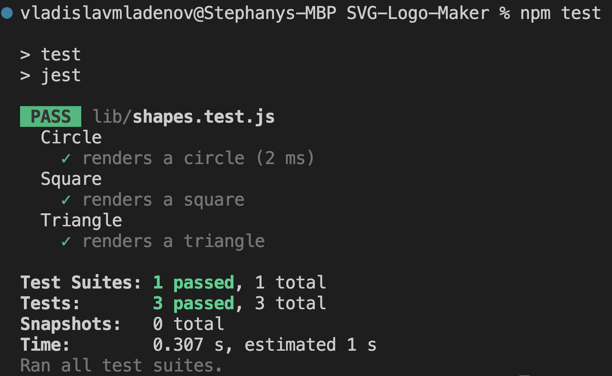

# SVG-Logo-Maker

## Description
The SVG-Logo-Maker is a command-line tool that generates SVG logos in various shapes with custom text and color. It uses the Inquirer package to prompt users for inputs, and the SVG syntax to create the logos.

## Table of Contents
- [Installation](#installation)
- [Usage](#usage)
- [License](#license)
- [Tests](#tests)
- [Links](#links)
- [Questions](#questions)

## Installation
To install the SVG-Logo-Maker, clone this repository and run "npm install" to install the dependencies:


```
git clone https://github.com/Vlad1slav86/SVG-Logo-Maker.git
cd SVG-Logo-Maker

npm install
````

## Usage
To use the SVG-Logo-Maker, run the index.js file in your terminal:

```
node index.js
```
You will be prompted to select a shape (circle, square, or triangle), enter a text (up to 3 characters), choose text and shape color. After you've entered all the inputs, an SVG file will be generated in the output directory with the filename logo.svg.

## License
This project is licensed under the MIT license.

## Tests
To run tests for the SVG-Logo-Maker, open a terminal window and navigate to the project directory. Run the following command:

```
npm test
```

This will run the test suite and display the results in the terminal.

## Screenshots

Enter desired parameters when prompted.

[]

Generated SVG Logo with user's input.

[]

A successful test.

[]

## Links:

Repo: https://github.com/Vlad1slav86/SVG-Logo-Maker

Walkthrough video: https://drive.google.com/file/d/1eGk2KDzNvA-R4oIgI4pz9aRmK3Lhjdle/preview

## Questions
If you have any questions about the SVG-Logo-Maker, please contact me at vladkb@yahoo.com. You can also find more information and contact me on my [GitHub profile](https://github.com/Vlad1slav86).
